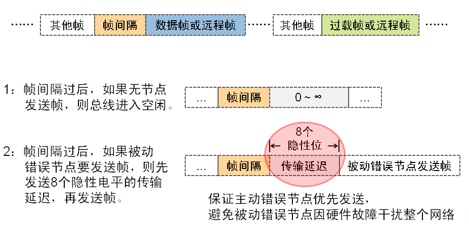
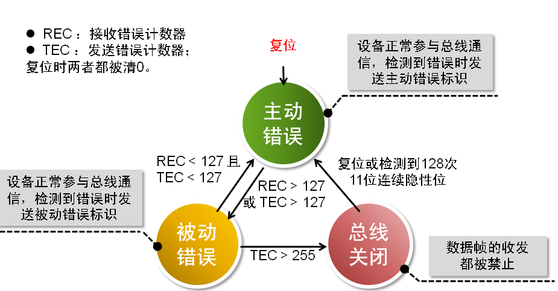

[toc]

# 一、CAN BUS

## 1 基础知识

### 1.1 简介

现场总线:

- 是一种工业数据总线，是自动化领域中底层数据通信网络。
- 主要解决工业现场的智能化仪器仪表、控制器、执行机构等现场设备间的数字通信以及这些现场控制设备和高级控制系统之间的信息传递问题。现场总线具有简单、可靠、经济实用等一系列突出的优点。

CAN:

- CAN 是控制器局域网络(Controller Area Network, CAN)的简称。
- CAN-bus： Controller Area Network-bus，控制器局域网总线。
- 是一种有效支持分布式控制或实时控制的串行通信网络。
- 德国博世公司(BOSCH)开发，通过 ISO11898 及 ISO11519 进行了标准化，目前已是汽车网络的标准协议，也是国际上应用最广泛的现场总线之一。

### 1.2 优点

基于 CAN 总线的分布式控制系统在以下方面具有明显的优越性：

- 网络内的节点个数在理论上不受限制
- 结构简单，只有 2 根线与外部相连，并且内部集成了错误探测和管理模块。
- 数据通信没有主从之分，任意一个节点可以向任何其他（一个或多个）节点发起数据通信，靠各个节点信息优先级先后顺序来决定通信次序。

### 1.3 标准

CAN 总线有两个 ISO 国际标准：ISO11898 和 ISO11519

- ISO11898 定义了通信速率为 125 kbps ～ 1 Mbps 的高速 CAN 通信标准，属于闭环总线，传输速率可达 1Mbps，总线长度 ≤ 40 米。
- ISO11519 定义了通信速率为 10 ～ 125 kbps 的低速 CAN 通信标准，属于开环总线，传输速率为 40kbps 时，总线长度可达 1000 米。
- 闭环网络总线
  
- 开环网络总线
  

## 2 结构和数据传输

### 2.1 CAN 总线系统结构

1. CAN 控制器
   接收控制单元中微处理器发出的数据，处理数据并传给 CAN 收发器
2. CAN 收发器
   将数据传到总线 or 从总线接收数据给控制器
3. CAN 数据传递终端（电阻）
   避免数据传输终了反射回来
4. CAN 数据总线
   传输数据的数据线，两根 CAN-high and CAN-low，差分信号

### 2.2 CAN 总线系统的数据传输

CAN 总线节点上的节点发送数据是以报文的形式广播给网络中所有节点。收发器接收到数据就把数据传送给控制器，再由控制器检查判断是不是所需数据。不是则忽略。

- 网络上任何一个节点在任何时候都可以发送数据
- 多个节点发送数据，优先级低主动退出发送
- 短帧结构，每帧数据信息为 0~8 字节（具体用户定义），对数据编码而不是地址编码
- CAN 每帧都有 CRC 校验和其他检验措施，严重错误的情况下具有自动关闭输出的功能

### 2.3 CAN 总线系统数据格式

CAN-bus 通信帧共分为数据帧、远程帧、错误帧、过载帧和帧间隔五种类型。

- 显性隱性
  CAN-Bus 发布了 ISO11898 和 ISO11519 两个通信标准，这两个标准中差分电平的特性不相同
  
  |物理层|ISO11898||ISO11519-2||
  |:----:|:----:|:----:|:----:|:----:|
  |电平|隱性|显性|隱性|显性|
  |CAN_H/V|2.5|3.5|1.75|4|
  |CAN_L/V|2.5|1.5|3.25|1|
  |电位差/V|0|2|-1.5|3|
  **0 代表显性电平，1 代表隱性电平。**

- 数据帧
  结构上由 7 个段组成，其中根据仲裁段 ID 码长度的不同，分为标准帧（CAN2.0A）和扩展帧（CAN2.0B）。
  

  - 帧起始、帧结束
    帧起始和帧结束用于界定一个数据帧，无论是标准数据帧或扩展帧都包含这两个段。

  - 仲裁段
    CAN 总线并没有规定节点的优先级，但通过仲裁段帧 ID 规定了数据帧的优先级。根据 CAN2.0 标准版本不同，帧 ID 分为 11 位和 29 位两种。
    

    - 总线仲裁
      CAN 控制器在发送数据的同时监测数据线的电平是否与发送数据对应电平相同，如果不同，则停止发送并做其他处理。
      

  > 示例 1：
  > 假设节点 A、B 和 C 发送相同格式相同类型的帧，如标准格式数据帧，它们竞争总线的过程是：
  > 
  > 从该分析过程得出的结论是：帧 ID 值越小，优先级越高。
  > 对于同为扩展格式数据帧、标准格式远程帧和扩展格式远程帧的情况同理。

  > 示例 2：
  > 
  > 由于数据帧的 RTR 位为显性电平，远程帧的 RTR 位为隱性电平，所以帧格式和帧 ID 都相同的情况下，数据帧的优先级比远程帧优先级高。

  > 示例 3：
  > 
  > 由于标准帧的 IDE 位为显性电平，扩展帧的 IDE 为隱性电平，对于前 11 位 ID 相同的标准帧和扩展帧，标准帧的优先级比扩展帧高。

  - 控制段
    控制段共 6 位，标准帧的控制段由扩展帧标志位 IDE、保留位 r0 和数据长度代码 DLC 组成；扩展帧控制段则由 IDE、r1、r0 和 DLC 组成。
    

  - 数据段
    一个数据帧传输的数据量为 0~8 个字节，这种短帧结构使得 CAN-Bus 实时性很高，非常适合汽车和工控应用场合。
    

  > 与其他总线协议相比，CAN-bus 的短帧结构优势：
  > 数据量小，发送和接收时间短，实时性高，被干扰的概率小，抗干扰能力强。

  - CRC 段
    CAN-Bus 使用 CRC 校验进行数据检错，CRC 校验值存放于 CRC 段。CRC 校验段由 15 位 CRC 值和 1 位 CRC 界定符构成。
    

  - ACK 段
    当一个接收节点接收的帧起始到 CRC 段之间的内容没有发生错误时，它将在 ACK 段发送一个显性电平。
    

- 远程帧
  与数据帧相比，远程帧结构上无数据段，由 6 个段组成，同样分成标准格式和扩展格式，RTR 位为 1(隱性电平)。
  

  - 数据帧和远程帧的区别
    

- 过载帧
  当某个接收节点没有做好接收下一帧数据的准备时，将发送过载帧以通知发送节点，过载帧由过载标志和过载界定符组成。
  

  > （纠错，过载标志显性电平为 0）

  由于存在多个节点同时过载且过载帧发送有时间差问题，可能出现过载标志叠加后超过 6 个位的现象。
  

- 帧间隔
  帧间隔用于将数据帧或远程帧和它们之前的帧分开，但过载帧和错误帧前面不会插入帧间隔。
  

- CAN-Bus 整个链路层处理数据的流程是：
  

- CAN-Bus 错误类型
  CAN-Bus 的错误类型共 5 种。
  
  当出现 5 种错误类型之一时，发送或接收节点将发送错误帧。错误帧的结构如下，其中错误标识分为主动错误标识和被动错误标识。
  

  > (纠错：主动错误标识显性电平为 0)

  为防止自身由于某些原因导致无法正常接收的节点一直发送错误帧，干扰其他节点通信，CAN-Bus 规定了节点的 3 种状态及其行为。
  

  - 如何理解三种错误状态

    主动错误，发现错误后主动打断这一帧错误并通知其他节点。这样的行为可以理解为当前节点认为自己状态很健康，发现错误有必要主动采取措施，保证整个总线的数据正常传输。

    被动错误，节点发现出错太多，这些错误很有可能是自身的原因产生的，对自身的状态产生怀疑，所以不再主动对总线上的错误采取措施。

    离线状态，节点发现错误过于频繁，并且很多错误是由自己发送产生的，此时需要将自己从总线上隔离出去，防止进一步影响其他节点通讯。
