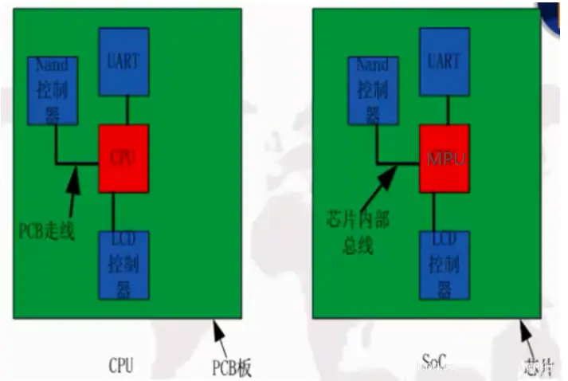

[toc]

# CPU、MPU、MCU、SOC 的概念和区别

##  1. 概念

### **1.1 CPU(Central Processing Unit)**
CPU(Central Processing Unit)，是一台计算机的运算核心和控制核心。CPU 由运算器、控制器和寄存器及实现它们之间联系的数据、控制及状态的总线构成。众所周知的三级流水线：取址、译码、执行的对象就是 CPU，差不多所有的 CPU 的运作原理可分为四个阶段：提取(Fetch)、解码(Decode)、执行(Execute)和写回(Writeback)。 CPU 从存储器或高速缓冲存储器中取出指令，放入指令寄存器，并对指令译码，并执行指令。所谓的计算机的可编程性主要是指对 CPU 的编程。

### **1.2 MPU (Micro Processor Unit)**
MPU (Micro Processor Unit)，叫微处理器(不是微控制器 MCU，很多人会把微处理器和微控制器混淆)，通常代表一个功能强大的 CPU(暂且理解为增强版的 CPU 吧),但不是为任何已有的特定计算目的而设计的芯片。这种芯片往往是个人计算机和高端工作站的核心 CPU。例如 Intel 的 X86，ARM 的一些 Cortex-A 芯片如飞思卡尔 i.MX6、全志 A20、TI AM335X 等都属于 MPU。

### **1.3 MCU(Micro Control Unit)**
MCU(Micro Control Unit)：叫微控制器，其实就是我们平常说的单片机。是指随着大规模集成电路的出现及其发展，将计算机的 CPU、RAM、ROM、定时计数器和多种 I/O 接口集成在一片芯片上，形成芯片级的芯片，比如 51、STC、AVR、Cortex-M 这些芯片，内部除了 CPU 外还有 RAM、ROM，也就是在一块芯片中集成了整个计算机系统，可以直接加简单的外围器件(电阻，电容)就可以运行代码了。它本质上仍是一个完整的单片机，有处理器，有各种接口，所有的开发都是基于已经存在的系统架构，应用者要做的就是开发软件程序和加外部设备。而像 ARM（Cortex-A 系列）直接放代码是运行不了的，因为它本质上只是增强版的 CPU，必须添加相应的 RAM 和 ROM。

### **1.4 SoC(System on Chip)**
SoC(System on Chip，整体的一个电路系统，完成一个具体功能的东西)：指的是片上系统，MCU 只是芯片级的芯片，而 SoC 是系统级的芯片，它既 MCU 那样有内置 RAM、ROM 同时又像 MPU 那样强大，不单单是放简单的代码，可以放系统级的代码，也就是说可以运行操作系统（以 Linux OS 为主）(将就认为是 MCU 集成化与 MPU 强处理力各优点二合一)。

### **1.5 SoPC(System On a Programmable Chip)**
与上述几项概念相比，SoPC 的出现频率并不是那么高，但这并不影响它的重要性。SOPC 是 System On a Programmable Chip 的缩写，即 可编程片上系统，SoPC 与 MCU、MPU、SoC 最明显的区别在于：可更改硬件配置，也就是说自己构造芯片。

举个例子说明便于理解，单片机的硬件配置是固化好了的， 我们能够编程修改的就是软件配置，本来是串口通信功能，通过修改代码变成 AD 采样功能，也就是说硬件配置是固定了的，我们只能通过修改软件来选择其中的一项或多项功能；而 SoPC 可以修改硬件配置信息使其成为相应的芯片，可以是 MCU，也可以是 SoC。

## 2. 区别

### **2.1 MCU 和 MPU 的区别**
MCU 在一块芯片中集成了整个计算机系统，可以直接加简单的外围器件(电阻，电容)就可以运行代码了。它本质上仍是一个完整的单片机，有处理器，有各种接口，所有的开发都是基于已经存在的系统架构，应用者要做的就是开发软件程序和加外部设备。

MPU 如 ARM 的 Cortex-A 系列，直接放代码是运行不了的，因为它本质上只是增强版的 CPU，必须添加相应的 RAM 和 ROM。

### **2.2 CPU 与 SoC 的区别**
SoC 可以认为是将 MCU 集成化与 MPU 强处理力各优点二合一，其中 MCU 是 CPU 集成了各类外设，MPU 是增强版的 CPU。可以从下图中直观地看出 CPU 与 SoC 的区别。

### **2.3 SoPC 与 MCU、MPU、SoC 的区别**
SoPC 与 MCU、MPU、SoC 最明显的区别在于：可更改硬件配置，也就是说自己构造芯片。

举个例子说明便于理解，单片机的硬件配置是固化好了的， 我们能够编程修改的就是软件配置，本来是串口通信功能，通过修改代码变成 AD 采样功能，也就是说硬件配置是固定了的，我们只能通过修改软件来选择其中的一项或多项功能；而 SoPC 可以修改硬件配置信息使其成为相应的芯片，可以是 MCU，也可以是 SoC。

作者：信盈达 https://www.bilibili.com/read/cv17374668?spm_id_from=333.999.0.0 出处：bilibili
